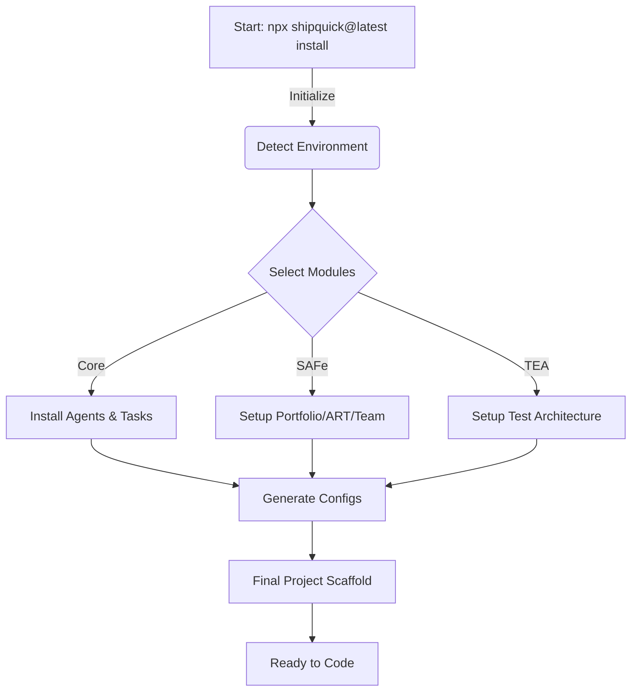

# Shipquick Enterprise

**The Agentic AI Software Factory for SAFe 6.0**

Shipquick automates the creation of an enterprise-grade development environment where Humans and AI Agents collaborate. It combines **BMad Method** (Agent Workflows), **SAFe 6.0** (Scaled Agile), and **Beads** (State Management) into a single, deployable framework.

---

## 🚀 How It Works (The Flow)



---

## 🎓 Step-by-Step Training Guide

Follow these steps to transform an empty folder into a fully functional Agentic Software Factory.

### Step 1: Initialize the Factory

Open your terminal in the folder where you want to build your project.

```bash
# Run the installer (No download required)
npx shipquick@latest install
```

### Step 2: Configure Your Factory

The installer will guide you through a setup wizard.
Make the following selections for a complete Enterprise setup:

1.  **Project Name**: Enter your project name (e.g., `MyEnterpriseApp`).
2.  **Modules**:
    - ✅ **Shipquick Core**: (Required) Installs base Agents (Analyst, Dev, Architect).
    - ✅ **BMad Method**: Adds 50+ standard workflows.
    - ✅ **SAFe 6.0**: Adds Portfolio, Solution, and Agile Release Train (ART) structure.
    - ✅ **Test Architect (TEA)**: Adds enterprise testing frameworks.
3.  **IDE Integration**: Select your AI Editor (VS Code, Cursor, Windsurf, GitHub Copilot).

### Step 3: Verify the Setup

Once installed, you will see a new directory structure:

- 📂 **`.agent/`**: Contains all Workflow definitions.
- 📂 **`_bmad/`**: Contains the Brain of the system (Agents & Tasks).
- 📂 **`_bmad/sq/`**: SAFe Hierarchy (Portfolio/Epics/Stories).
- 📄 **`agents.md`**: The rulebook for your AI Agents.

### Step 4: Start Building

You are now ready to use **Agentic Workflows**.
For example, to start a new feature:

1.  Open `agents.md` to see available specialized agents.
2.  Use **Beads** (installed automatically) to track your work:
    ```bash
    bd create " Implement User Login"
    ```
3.  Or execute a workflow directly via your IDE's AI Command palette.

---

## 📦 For Contributors

If you want to modify the Shipquick installer itself:

- **Source Code**: Located in `_npm-package/`.
- **Build**: Run `npm run bundle` inside `_npm-package/`.
- **Test**: Run `npm link` and then `shipquick install` to test local changes.

---

**Repository**: [Shipquick-enterprise](https://github.com/CivilEngineersCanAlsoCode/Shipquick-enterprise)
**Maintained by**: CivilEngineersCanAlsoCode
