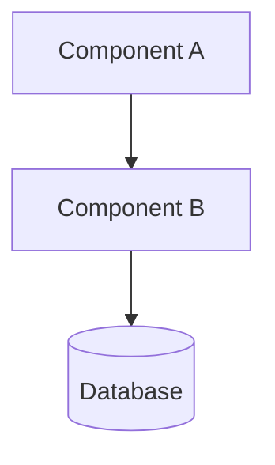

# Architecture Decision Record (ADR)

---

**Decision ID**: [ADR-XXXX]
**Status**: PROPOSED / ACCEPTED / SUPERSEDED
**Feature Link**: [Feature-ID]

---

## 1. Context & Problem Statement

[Describe the technical challenge. Why is this decision needed? What are the constraints?]

## 2. Decision Rationale

**The Decision**: [State the choice made]
**Rationale**: [Why was this choice made over others? Link to business value or NFRs.]

## 3. Considered Options

| Option       | Pros      | Cons   |
| :----------- | :-------- | :----- |
| **Option A** | [Benefit] | [Risk] |
| **Option B** | [Benefit] | [Risk] |

## 4. Design & Implementation

[Deep-dive into the technical details.]

## 5. Metadata for Engineering

- **Implementation Effort**: [Low / Medium / High]
- **Affected Packages**: [List packages]
- **Security Audit Required**: [YES / NO]
