# Master Workspace Directory: Safe Agile Agentic Framework

This document is the absolute "Source of Truth" for the project structure. It contains every individual file and subfolder categorized by their role in the **BMAD (Breakthrough Method of Agile Driven AI Product Development)** framework.

## 🌳 Hierarchical Overview (Top-Level)

```mermaid
graph TD
    1["1. Root Project (/)"] --> 1.1["1.1 📄 AGENTS.md, Gemini.md, index.md"]
    1 --> 1.2["1.2 📂 Instructions to Use/"]
    1 --> 1.3["1.3 📂 _bmad/ (Framework Core)"]
    1 --> 1.4["1.4 📂 .agent/ (Workflows)"]
    1 --> 1.5["1.5 📂 .kiro/ (Steering Files)"]
    1 --> 1.6["1.6 📂 .beads/ (Issue Data)"]
```

## 📋 Comprehensive Folder & File Index (Sr. No.)

| Sr. No. | Linked Path                                                    | Type   | One-Line Definition                                               |
| :------ | :------------------------------------------------------------- | :----- | :---------------------------------------------------------------- |
| 1       | **[AGENTS.md](./AGENTS.md)**                                   | File   | Mandatory agent session protocols and "Landing the Plane" rules.  |
| 2       | **[Gemini.md](./Gemini.md)**                                   | File   | Persistent log for documenting and preventing technical mistakes. |
| 3       | **[index.md](./index.md)**                                     | File   | This exhaustive deep-dive directory of the entire workspace.      |
| 4       | **[Instructions to Use/](./Instructions%20to%20Use/)**         | Folder | User-facing manuals and operational onboarding guides.            |
| 4.1     | **[BEADS_GUIDE.md](./Instructions%20to%20Use/BEADS_GUIDE.md)** | File   | Romanised Hindi guide for the Beads distributed issue tracker.    |
| 5       | **[\_bmad/](./_bmad/)**                                        | Folder | The core framework containing all agentic modules and logic.      |
| 5.1     | **[\_bmad/bmm/](./_bmad/bmm/)**                                | Module | Business Module for product management, stories, and epics.       |
| 5.2     | **[\_bmad/bmb/](./_bmad/bmb/)**                                | Module | Bmad Builder for meta-agent creation and module generation.       |
| 5.3     | **[\_bmad/cis/](./_bmad/cis/)**                                | Module | Creative Intelligence Suite for innovation workflows.             |
| 5.4     | **[\_bmad/gds/](./_bmad/gds/)**                                | Module | Game Dev Studio for mechanics and technical game design.          |
| 5.5     | **[\_bmad/tea/](./_bmad/tea/)**                                | Module | Test Architecture for quality gates and automation loops.         |
| 5.6     | **[\_bmad/core/tasks/](./_bmad/core/tasks/)**                  | Folder | Atomic system-level tasks (e.g., indexing, sharding).             |
| 6       | **[.agent/workflows/](./.agent/workflows/)**                   | Folder | Exhaustive list of all interactive slash command scripts.         |
| 7       | **[.kiro/steering/](./.kiro/steering/)**                       | Folder | AI behavior guidance files for framework compliance.              |
| 8       | **[.beads/](./.beads/)**                                       | Folder | Local persistence database for all issue tracking data.           |

## 📂 Full Recursive File-Level Tree

- **1. [./](./) (Root Project)**
  - **1.1 [.agent/](./.agent/)**
    - **1.1.1 [workflows/](./.agent/workflows/)**
      - 1.1.1.1 [agent-builder.md](./.agent/workflows/agent-builder.md)
      - 1.1.1.2 [analyst.md](./.agent/workflows/analyst.md)
      - 1.1.1.3 [architect.md](./.agent/workflows/architect.md)
      - 1.1.1.4 [bmad-master.md](./.agent/workflows/bmad-master.md)
      - 1.1.1.5 [check-implementation-readiness.md](./.agent/workflows/check-implementation-readiness.md)
      - 1.1.1.6 [code-review.md](./.agent/workflows/code-review.md)
      - 1.1.1.7 [create-epics-and-stories.md](./.agent/workflows/create-epics-and-stories.md)
      - 1.1.1.8 [dev-story.md](./.agent/workflows/dev-story.md)
      - 1.1.1.9 [index-docs.md](./.agent/workflows/index-docs.md)
  - **1.2 [.augment/](./.augment/)**
  - **1.3 [.beads/](./.beads/)**
    - 1.3.1 [config.yaml](./.beads/config.yaml)
    - 1.3.2 [metadata.json](./.beads/metadata.json)
    - 1.3.3 [README.md](./.beads/README.md)
  - **1.4 [.kiro/](./.kiro/)**
    - **1.4.1 [steering/](./.kiro/steering/)**
      - 1.4.1.1 [bmad-agent-bmm-pm.md](./.kiro/steering/bmad-agent-bmm-pm.md)
      - 1.4.1.2 [bmad-agent-bmm-architect.md](./.kiro/steering/bmad-agent-bmm-architect.md)
      - 1.4.1.3 [bmad-bmm-create-prd.md](./.kiro/steering/bmad-bmm-create-prd.md)
  - **1.5 [\_bmad/](./_bmad/)**
    - **1.5.1 [\_config/](./_bmad/_config/)**
      - 1.5.1.1 [agent-manifest.csv](./_bmad/_config/agent-manifest.csv)
      - 1.5.1.2 [manifest.yaml](./_bmad/_config/manifest.yaml)
      - 1.5.1.3 [task-manifest.csv](./_bmad/_config/task-manifest.csv)
      - 1.5.1.4 [tool-manifest.csv](./_bmad/_config/tool-manifest.csv)
      - 1.5.1.5 [workflow-manifest.csv](./_bmad/_config/workflow-manifest.csv)
    - **1.5.2 [\_memory/](./_bmad/_memory/)**
      - 1.5.2.1 **[tech-writer-sidecar/](./_bmad/_memory/tech-writer-sidecar/)**
      - 1.5.2.2 **[storyteller-sidecar/](./_bmad/_memory/storyteller-sidecar/)**
    - **1.5.3 [bmm/](./_bmad/bmm/)** (Business Module)
      - **1.5.3.1 [agents/](./_bmad/bmm/agents/)**
        - 1.5.3.1.1 [pm.md](./_bmad/bmm/agents/pm.md)
        - 1.5.3.1.2 [analyst.md](./_bmad/bmm/agents/analyst.md)
        - 1.5.3.1.3 [architect.md](./_bmad/bmm/agents/architect.md)
        - 1.5.3.1.4 [dev.md](./_bmad/bmm/agents/dev.md)
        - 1.5.3.1.5 [qa.md](./_bmad/bmm/agents/qa.md)
      - **1.5.3.2 [workflows/](./_bmad/bmm/workflows/)**
        - 1.5.3.2.1 [create-prd.xml](./_bmad/bmm/workflows/create-prd.xml)
        - 1.5.3.2.1 [sprint-planning.xml](./_bmad/bmm/workflows/sprint-planning.xml)
        - 1.5.3.2.1 [code-review.xml](./_bmad/bmm/workflows/code-review.xml)
      - 1.5.3.3 [config.yaml](./_bmad/bmm/config.yaml)
    - **1.5.4 [bmb/](./_bmad/bmb/)** (Builder Module)
      - **1.5.4.1 [agents/](./_bmad/bmb/agents/)**
        - 1.5.4.1.1 [agent-builder.md](./_bmad/bmb/agents/agent-builder.md)
        - 1.5.4.1.2 [module-builder.md](./_bmad/bmb/agents/module-builder.md)
        - 1.5.4.1.3 [workflow-builder.md](./_bmad/bmb/agents/workflow-builder.md)
      - **1.5.4.2 [workflows/](./_bmad/bmb/workflows/)**
        - 1.5.4.2.1 [create-module.xml](./_bmad/bmb/workflows/create-module.xml)
        - 1.5.4.2.2 [create-agent.xml](./_bmad/bmb/workflows/create-agent.xml)
    - **1.5.5 [cis/](./_bmad/cis/)** (Creative Suite)
      - **1.5.5.1 [agents/](./_bmad/cis/agents/)**
        - 1.5.5.1.1 [storyteller.md](./_bmad/cis/agents/storyteller.md)
        - 1.5.5.1.2 [brainstorming-coach.md](./_bmad/cis/agents/brainstorming-coach.md)
        - 1.5.5.1.3 [innovation-strategist.md](./_bmad/cis/agents/innovation-strategist.md)
    - **1.5.6 [gds/](./_bmad/gds/)** (Game Dev Studio)
      - **1.5.6.1 [agents/](./_bmad/gds/agents/)**
        - 1.5.6.1.1 [game-designer.md](./_bmad/gds/agents/game-designer.md)
        - 1.5.6.1.2 [game-architect.md](./_bmad/gds/agents/game-architect.md)
        - 1.5.6.1.3 [game-dev.md](./_bmad/gds/agents/game-dev.md)
      - **1.5.6.2 [workflows/](./_bmad/gds/workflows/)**
        - 1.5.6.2.1 [create-gdd.xml](./_bmad/gds/workflows/create-gdd.xml)
        - 1.5.6.2.2 [game-brief.xml](./_bmad/gds/workflows/game-brief.xml)
    - **1.5.7 [tea/](./_bmad/tea/)** (Test Architecture)
      - **1.5.7.1 [agents/](./_bmad/tea/agents/)**
        - 1.5.7.1.1 [tea.md](./_bmad/tea/agents/tea.md)
      - **1.5.7.2 [workflows/](./_bmad/tea/workflows/)**
        - 1.5.7.2.1 [testarch-trace.xml](./_bmad/tea/workflows/testarch-trace.xml)
        - 1.5.7.2.2 [testarch-automate.xml](./_bmad/tea/workflows/testarch-automate.xml)
    - **1.5.8 [core/](./_bmad/core/)**
      - **1.5.8.1 [tasks/](./_bmad/core/tasks/)**
        - 1.5.8.1.1 [index-docs.xml](./_bmad/core/tasks/index-docs.xml)
        - 1.5.8.1.2 [workflow.xml](./_bmad/core/tasks/workflow.xml)
        - 1.5.8.1.3 [editorial-review-prose.xml](./_bmad/core/tasks/editorial-review-prose.xml)
        - 1.5.8.1.4 [shard-doc.xml](./_bmad/core/tasks/shard-doc.xml)
  - **1.6 [Instructions to Use/](./Instructions%20to%20Use/)**
    - 1.6.1 [BEADS_GUIDE.md](./Instructions%20to%20Use/BEADS_GUIDE.md)
  - 1.7 [AGENTS.md](./AGENTS.md)
  - 1.8 [Gemini.md](./Gemini.md)
  - 1.9 [.kilocodemodes](./.kilocodemodes)
  - 1.10 [.gitattributes](./.gitattributes)
  - 1.11 [index.md](./index.md)

---

## 📄 Exhaustive Component Descriptions

| Sr. No.   | Component                                                                                 | One-Line Description                                                  |
| :-------- | :---------------------------------------------------------------------------------------- | :-------------------------------------------------------------------- |
| 1         | **[./](./)**                                                                              | Root directory of the Safe Agile Agentic Framework workspace.         |
| 1.1       | **[.agent/](./.agent/)**                                                                  | Internal configuration and workflow definitions for agents.           |
| 1.1.1     | **[workflows/](./.agent/workflows/)**                                                     | Collection of interactive agent scripts and task flows.               |
| 1.1.1.1   | [agent-builder.md](./.agent/workflows/agent-builder.md)                                   | Workflow for creating and configuring new BMAD agents.                |
| 1.1.1.2   | [analyst.md](./.agent/workflows/analyst.md)                                               | Guidance for the Business Analyst agent role.                         |
| 1.1.1.3   | [architect.md](./.agent/workflows/architect.md)                                           | Architectural steering and design principles for the Architect agent. |
| 1.1.1.4   | [bmad-master.md](./.agent/workflows/bmad-master.md)                                       | Master orchestration logic for the BMAD framework.                    |
| 1.1.1.5   | [check-implementation-readiness.md](./.agent/workflows/check-implementation-readiness.md) | Pre-implementation validation workflow for quality assurance.         |
| 1.1.1.6   | [code-review.md](./.agent/workflows/code-review.md)                                       | Automated adversarial code review protocol for high quality.          |
| 1.1.1.7   | [create-epics-and-stories.md](./.agent/workflows/create-epics-and-stories.md)             | Workflow for decomposing PRDs into Epics and Stories.                 |
| 1.1.1.8   | [dev-story.md](./.agent/workflows/dev-story.md)                                           | Execution workflow for developer agents to implement stories.         |
| 1.1.1.9   | [index-docs.md](./.agent/workflows/index-docs.md)                                         | Workflow for maintaining and updating the project index.              |
| 1.2       | **[.augment/](./.augment/)**                                                              | Extension directory for augmenting agent capabilities.                |
| 1.3       | **[.beads/](./.beads/)**                                                                  | Local persistence and config for the Beads issue tracking system.     |
| 1.3.1     | [config.yaml](./.beads/config.yaml)                                                       | Settings for the Beads issue tracker behavior.                        |
| 1.3.2     | [metadata.json](./.beads/metadata.json)                                                   | High-level configuration and version metadata for Beads.              |
| 1.3.3     | [README.md](./.beads/README.md)                                                           | Beads setup and usage documentation.                                  |
| 1.4       | **[.kiro/](./.kiro/)**                                                                    | AI steering and behavioral configuration store.                       |
| 1.4.1     | **[steering/](./.kiro/steering/)**                                                        | Role-specific guidance files to ensure agent alignment.               |
| 1.4.1.1   | [bmad-agent-bmm-pm.md](./.kiro/steering/bmad-agent-bmm-pm.md)                             | Behavioral rules for the Product Manager agent.                       |
| 1.4.1.2   | [bmad-agent-bmm-architect.md](./.kiro/steering/bmad-agent-bmm-architect.md)               | Technical steering rules for the Architect agent.                     |
| 1.4.1.3   | [bmad-bmm-create-prd.md](./.kiro/steering/bmad-bmm-create-prd.md)                         | Specific guidance for the PRD creation workflow.                      |
| 1.5       | **[\_bmad/](./_bmad/)**                                                                   | Core directory containing all BMAD modules and system logic.          |
| 1.5.1     | **[\_config/](./_bmad/_config/)**                                                         | Global manifests for agents, workflows, tools, and files.             |
| 1.5.1.1   | [agent-manifest.csv](./_bmad/_config/agent-manifest.csv)                                  | Registry of all available agents and their metadata.                  |
| 1.5.1.2   | [manifest.yaml](./_bmad/_config/manifest.yaml)                                            | Core system configuration and module version tracking.                |
| 1.5.1.3   | [task-manifest.csv](./_bmad/_config/task-manifest.csv)                                    | Directory of all atomic system tasks.                                 |
| 1.5.1.4   | [tool-manifest.csv](./_bmad/_config/tool-manifest.csv)                                    | Mapping of tools to their respective functionalities.                 |
| 1.5.1.5   | [workflow-manifest.csv](./_bmad/_config/workflow-manifest.csv)                            | Registry of all cross-module workflows.                               |
| 1.5.2     | **[\_memory/](./_bmad/_memory/)**                                                         | Sidecar memory storage for specific agent personas.                   |
| 1.5.2.1   | **[tech-writer-sidecar/](./_bmad/_memory/tech-writer-sidecar/)**                          | Documentation standards and memory for the Tech Writer.               |
| 1.5.2.2   | **[storyteller-sidecar/](./_bmad/_memory/storyteller-sidecar/)**                          | Narrative patterns and memory for the Storyteller agent.              |
| 1.5.3     | **[bmm/](./_bmad/bmm/)**                                                                  | Business Module Management for product and requirements engineering.  |
| 1.5.3.1   | **[agents/](./_bmad/bmm/agents/)**                                                        | Business-focused agent persona definitions (PM, Analyst, etc.).       |
| 1.5.3.1.1 | [pm.md](./_bmad/bmm/agents/pm.md)                                                         | Persona and rules for the Product Manager agent.                      |
| 1.5.3.1.2 | [analyst.md](./_bmad/bmm/agents/analyst.md)                                               | Persona and rules for the Business Analyst agent.                     |
| 1.5.3.1.3 | [architect.md](./_bmad/bmm/agents/architect.md)                                           | Persona and rules for the Technical Architect agent.                  |
| 1.5.3.1.4 | [dev.md](./_bmad/bmm/agents/dev.md)                                                       | Persona and rules for the Developer agent.                            |
| 1.5.3.1.5 | [qa.md](./_bmad/bmm/agents/qa.md)                                                         | Persona and rules for the QA Engineer agent.                          |
| 1.5.3.2   | **[workflows/](./_bmad/bmm/workflows/)**                                                  | Core business processes like PRD creation and sprint planning.        |
| 1.5.3.3   | [config.yaml](./_bmad/bmm/config.yaml)                                                    | Configuration settings for the BMM module.                            |
| 1.5.4     | **[bmb/](./_bmad/bmb/)**                                                                  | Bmad Builder module for creating new modules and agents.              |
| 1.5.5     | **[cis/](./_bmad/cis/)**                                                                  | Creative Intelligence Suite for innovation and storytelling.          |
| 1.5.6     | **[gds/](./_bmad/gds/)**                                                                  | Game Dev Studio for specialized game architecture and design.         |
| 1.5.7     | **[tea/](./_bmad/tea/)**                                                                  | Test Engineering & Automation suite for quality governance.           |
| 1.5.8     | **[core/](./_bmad/core/)**                                                                | Fundamental system tasks and utility logic.                           |
| 1.5.8.1   | [tasks/](./_bmad/core/tasks/)                                                             | Atomic operations like document indexing and sharding.                |
| 1.6       | **[Instructions to Use/](./Instructions%20to%20Use/)**                                    | User-facing manuals for framework onboarding.                         |
| 1.6.1     | [BEADS_GUIDE.md](./Instructions%20to%20Use/BEADS_GUIDE.md)                                | Romanised Hindi manual for Beads issue tracking.                      |
| 1.7       | **[AGENTS.md](./AGENTS.md)**                                                              | Mandatory session protocols for agent compliance.                     |
| 1.8       | **[Gemini.md](./Gemini.md)**                                                              | Project log for tracking and preventing recurring mistakes.           |
| 1.9       | **[.kilocodemodes](./.kilocodemodes)**                                                    | Definitions for custom agent personas and activation rules.           |
| 1.10      | **[.gitattributes](./.gitattributes)**                                                    | Specialized merge settings for version-controlled data.               |
| 1.11      | **[index.md](./index.md)**                                                                | The exhaustive project directory and absolute source of truth.        |

---

> [!NOTE]
> This index is a 100% complete map of the project, featuring a hierarchical decimal numbering system for precise navigation.
