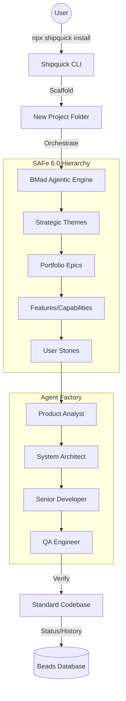

# Shipquick Enterprise 🚀

**The Autonomous Software Factory for SAFe 6.0**

Shipquick is not just an installer; it is a **Software Factory in a Box**. It solves the biggest problem in modern development: **The Gap between Strategy and Execution.**

By combining the **BMad Method** (Agent Orchestration), **SAFe 6.0** (Scaled Agile Framework), and **Beads** (Stateful State Management), Shipquick provides a production-ready environment where AI Agents don't just "chat"—they **deliver**.

---

## 🌟 Why Shipquick is Extraordinary

Most AI setups give you a single agent and a text box. Shipquick gives you a **Complete Managed Department**:

1.  **Autonomous Alignment**: Every line of code written by the **Dev Agent** is traced back to a **User Story**, which is linked to a **Feature**, an **Epic**, and ultimately your **Strategic Theme**. Alignment is mathematically guaranteed.
2.  **Persistent Intelligence (Beads)**: Most Agentic systems lose context. Shipquick uses **Beads**, a local state database that records every decision, mistake, and learning. Your factory gets smarter with every commit.
3.  **Zero-Friction Deployment**: No cloning repos, no complex env vars. **`npx shipquick@latest install`** is all you need to go from an empty folder to a scaled enterprise structure in 60 seconds.

---

## 🛠️ The Architecture of Success



---

## 🎓 The Journey: From Zero to Release (Detailed Walkthrough)

Follow these steps to transform an empty folder into a fully functional Agentic Software Factory.

### Step 1: The Big Bang (Initialization)

Run the following command in a clean directory. This triggers the **Enterprise Setup Wizard**.

```bash
# Force the latest version to ensure you get the newest agent personas
npx shipquick@latest install
```

### Step 2: Selecting Your Arsenal

During installation, you define the "personality" of your factory.

- **Shipquick Core**: Installs base Agents (Analyst, Dev, Architect).
- **BMad Method**: Adds 50+ standard workflows for PRDs, Tech Specs, and Code Reviews.
- **SAFe 6.0**: Deploys the hierarchy required (Strategic Themes -> Epics -> Features).
- **TEA (Test Architect)**: Initializes Playwright/Cypress for autonomous verification.

### Step 3: Agent-Level Workflow (The Magic)

Once installed, your factory operates on a **Discovery -> Decomposition -> Delivery** cycle.

1.  **Analyst Agent (`/create-prd`)**: Translates high-level vision into functional requirements.
2.  **Architect Agent (`/create-spec`)**: Designs the system and breaks requirements into **Epics** and **User Stories**.
3.  **Dev Agent (`bd create`)**: Picks up a Story and implements the code.
4.  **QA Agent (`/qa-automate`)**: Auto-generates and executes tests to verify the Dev Agent's work.

### Step 4: The Command Center (Beads & bd)

Use **Beads** to manage the state of your agents. This ensures that even if you switch projects or lose internet, the agents know exactly where they left off.

```bash
# Start a new implementation task
bd create "Implement Auth Module" -p 1

# Check progress across the entire team
bd list

# Sync local changes with the agentic state
bd sync
```

---

## 🧭 Directory Map for Navigators

- 📂 **`_bmad/`**: The "Intelligence" folder. Contains logic for all 7+ agent personas.
- 📂 **`.agent/workflows/`**: The "Playbook". Step-by-step instructions for complex tasks.
- 📂 **`_npm-package/`**: The "Engine Room". Source code for this specialized installer.
- 📄 **`agents.md`**: Your High-Level Operating Principles.
- 📄 **`gemini.md`**: The Knowledge Base (Records learnings and avoids repeat mistakes).

---

## 🤝 Community & Contribution

Shipquick is built for the community. If you want to refine the factory:

1.  Navigate to `_npm-package/`.
2.  Modify the logic in `src/lib/installer.js` or `messages.yaml`.
3.  Run `npm run bundle` to package your changes.

---

**Made with love by Satvik Jain** ❤️  
_Empowering engineers to lead the AI revolution._
