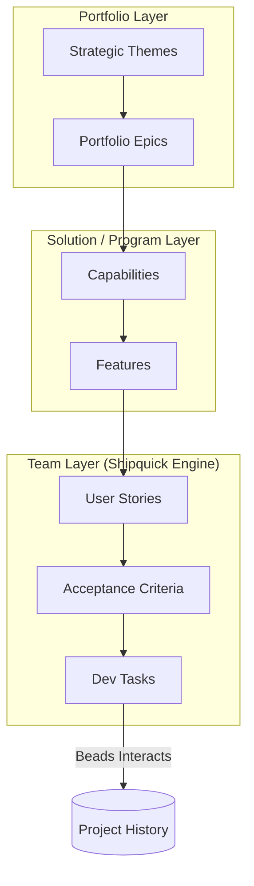

# Shipquick Enterprise: The Ultimate Manifesto 🚀

**An Extraordinary Software Factory for the AI Age**

---

## Volume 1: The Manifesto & Strategy

### 1.1 The Genesis: Why Shipquick Exists

In the early days of the AI revolution, developers were promised a world where coding was effortless. We were given "chatbots" and "autocompletes." But as any experienced engineer knows, **writing code is only 20% of the job.** The real complexity of software engineering lies in:

- **Alignment**: Ensuring what is built matches what the business actually needs.
- **Context**: Maintaining the thread of logic across thousands of files and months of development.
- **Verification**: Proving that a change doesn't break a critical enterprise system.

Traditional AI tools are **ephemeral**. They forget. They hallucinate. They operate in a vacuum.

**Shipquick was created to solve this.** It is not a tool; it is a **Permanent, Stateful Agentic Infrastructure**. It is designed for the engineer who knows that a "quick fix" is never enough—the engineer who requires a disciplined, repeatable, and scalable factory to deliver value at the speed of thought.

### 1.2 The Core Problem: The Decay of Context

The biggest enemy of engineering productivity is **Context Decay**.

- A developer creates a PRD in one tool.
- An architect designs the system in another.
- A junior dev writes the code, losing 50% of the original intent.
- The business looks at the result and wonders why it looks nothing like the vision.

Shipquick uses the **BMad Method** and **Beads** to create a "Closed-Loop Governance" where every artifact is linked, every agent is briefed, and every state is persisted.

### 1.3 Why Shipquick is Extraordinary

You might ask: _"I have ChatGPT, why do I need Shipquick?"_

Here is the truth: ChatGPT is a **Guest**. Shipquick is a **Resident**.

| Feature          | Standard AI Chat          | Shipquick Enterprise Factory                  |
| :--------------- | :------------------------ | :-------------------------------------------- |
| **Persistence**  | Session-based (Forgotten) | **Infinite Persistence** (via Beads local DB) |
| **Alignment**    | Ad-hoc / Guesswork        | **SAFe 6.0 Compliant** (Top-to-Bottom)        |
| **Logic**        | Text generation           | **Workflow Orchestration** (Structured Tasks) |
| **Context**      | Limited buffer            | **Beads-driven "Interactions"** (Zero-loss)   |
| **Verification** | None (You trust the AI)   | **Autonomous QA** (TEA Framework integration) |

### 1.4 Our Strategy: Building the Sovereignty of Code

We believe that every engineering team should own their own AI infrastructure. By using **Shipquick**, you are not just using an AI; you are deploying your own **Private, Sovereignty-First Factory**.

- It lives in your local environment.
- It understands your specific SAFe hierarchy.
- It respects your organization's architectural bounds.
- It grows more intelligent as you use it.

---

## Volume 2: SAFe 6.0 & Shipquick Alignment

### 2.1 The SAFe 6.0 Framework: A Refresher

The **Scaled Agile Framework (SAFe)** is the industry standard for scaling lean-agile practices across large organizations. It provides a structured hierarchy to ensure that thousands of people can work toward a single goal without chaos.

However, the "Execution Gap" in SAFe is usually the **Team Level**. Many organizations have a great Portfolio Strategy, but it gets mangled when it reaches the developer's keyboard.

### 2.2 How Shipquick Enforces SAFe 6.0

Shipquick is built as a **Hard-Coded Implementation** of SAFe 6.0. It doesn't just "support" SAFe; it **demands** it.



#### 2.2.1 Portfolio Strategy (Epics)

In Shipquick, you don't start by coding a button. You start by defining an **Epic**. Our agents are programmed to reject work that isn't tied to a validated Epic. This ensures that every hour of expensive AI processing is invested in high-value strategic goals.

#### 2.2.2 The ART (Agile Release Train)

Shipquick acts as the **Synchronous Beat** for your virtual Agile Release Train. By using standardized workflows, we ensure that every "Agent-Sprint" follows the same rigorous definition of done.

#### 2.2.3 Continuous Delivery Pipeline

Shipquick integrates directly with your CI/CD. The **QA Agent** won't mark a story as complete until the automated tests pass. This is **Built-in Quality**, one of the core SAFe values.

---

## Volume 3: The Agentic Workforce (Role Dossiers)

### 3.1 The Philosophy of Specialization

Generic AI tries to be everything. Shipquick agents are **Specialists**. They have been "Fine-Tuned" via proprietary system prompts and workflow instructions to excel in specific domains.

### 3.2 Agent Personas (Dossiers)

#### 🕵️‍♂️ The Analyst Agent (SQ-PM)

- **Primary Goal**: Maximizing Business Value.
- **Responsibility**: Translating raw user input into structured PRDs (Product Requirement Documents).
- **Tooling**: Uses the `/create-prd` and `/validate-prd` workflows.
- **Brain Structure**: Heavy focus on user psychology, market fit, and edge-case elicitation.

#### 📐 The Architect Agent (SQ-ARCH)

- **Primary Goal**: System Integrity and Technical Excellence.
- **Responsibility**: Designing the "Blueprint". Ensuring modularity, scalability, and adherence to design patterns.
- **Tooling**: Uses `/create-architecture` and `/traceability-matrix`.
- **Brain Structure**: Expert in Microservices, Hexagonal Architecture, and SOLID principles.

#### 👨‍💻 The Developer Agent (SQ-DEV)

- **Primary Goal**: Delivering Working Software.
- **Responsibility**: Writing clean, tested, and maintainable code.
- **Tooling**: Integrates with IDE extensions and uses `bd` for stateful implementation.
- **Brain Structure**: High performance in multiple languages (JS/TS, Python, Go) and framework-specific patterns.

#### 🧪 The QA Agent (SQ-TEA)

- **Primary Goal**: Preventing Regressions.
- **Responsibility**: Writing and executing automated tests.
- **Tooling**: Uses the TEA (Test Architecture) module and Playwright/Cypress.
- **Brain Structure**: Adversarial mindset. Specifically looks for where the Dev Agent might have missed a boundary condition.

---

## Volume 4: Technical Internals (The Engine Room)

### 4.1 Beads: The Distributed Brain

The most innovative component of Shipquick is **Beads**. In a world of stateless AI, Beads provides **Local, Stateful Memory**.

#### 4.1.1 How it Works

When an agent performs a task (e.g., creating a PRD), it doesn't just write a file. It creates an **Interaction** in the Beads database.

- **The Problem**: AI agents often "forget" the decisions made three prompts ago.
- **The Solution**: Beads stores the prompt, the response, the reasoning, and the metadata in an encrypted local database. When the next agent (e.g., the Architect) picks up the work, it "Consults the Beads" to understand the full context.

#### 4.1.2 The `bd` Command Suite

Users interact with the state engine using the `bd` CLI:

- `bd create "Task Name"`: Initializes a new stateful node.
- `bd list`: Shows the entire project's state tree.
- `bd sync`: Reconciles the local file changes with the agent's internal state.

### 4.2 Context Management & Token Efficiency

Shipquick is optimized for the **Advanced Agentic Coding** era. We use a "Pinning" strategy to ensure agents only see the code they need.

- **Project Context**: The `agents.md` file defines the overarching rules.
- **Task Context**: Only the files relevant to the current "Bead" are injected into the agent's prompt, preventing context overflow and reducing hallucination.

### 4.3 The Installer Architecture

The `shipquick` installer is a sophisticated Node.js application. Unlike simple `git clone` scripts, it:

1.  **Detects Environment**: Identifies your OS and shell configuration.
2.  **Vendors Dependencies**: Bundles binary dependencies (like the Beads Go engine) so they work out-of-the-box on Mac, Linux, and Windows.
3.  **Dynamic Scaffolding**: Builds the directory structure based on your specific module selections (Core vs. SAFe vs. TEA).

---

## Volume 5: Step-by-Step Implementation (Zero to Hero)

### 5.1 Preparation: The Foundation

Before you run the first command, ensure you have:

- Node.js (v18+)
- A Git repository initialized
- An IDE with AI capabilities (Cursor, VS Code + Copilot/Windsurf)

### 5.2 Phase 1: Deployment

Run the master command:

```bash
npx shipquick@latest install
```

**Pro Tip**: Always use `@latest` to ensure you have the most recent Agent Workflow definitions.

### 5.3 Phase 2: Configuration

The wizard will ask:

1.  **Project Name**: Crucial for the `package.json` generation.
2.  **Module Selection**:
    - Choose **Core** for smaller projects.
    - Choose **SAFe 6.0** for enterprise environments.
3.  **Language**: We currently support English and several regional localizations.

### 5.4 Phase 3: The First Interaction

Once installed, simulate the "Birth of a Feature":

1.  Create a Portfolio Epic file in `_bmad/sq/epics/`.
2.  Call the PM Agent via your IDE: `/create-story`.
3.  Watch as the agent decomposes your Epic into Features and User Stories.
4.  Run `bd list` to see your new stories appear in the state database.

### 5.5 Phase 4: Implementation & Verification

1.  Assign a story to yourself or the Dev Agent.
2.  Once the code is written, call the TEA Agent: `/qa-automate`.
3.  The TEA agent will generate a test report. If it's ✅ Green, you are ready for a Pull Request.

---

## Volume 6: Future Roadmap & Limitations

### 6.1 Current Limitations (The Honest Truth)

Shipquick is a powerful tool, but it is in its early stages of evolution. To ensure you have the best experience, be aware of the following:

- **Local-First Constraints**: Shipquick operates primarily on your local machine. While this is great for privacy and speed, it means real-time collaboration between remote team members requires external git synchronization.
- **Compute Intensity**: Running multiple high-fidelity agents requires a powerful machine and a stable API connection to your LLM provider.
- **Agent Latency**: Complex workflows (like 100% code coverage verification) can take time. This is "Async Engineering," not "Instant Chat."

### 6.2 The Roadmap: The Path to Total Autonomy

Our vision for the next 12 months includes:

1.  **Multi-Agent Collaborative Swarms**: Moving from sequential task handoffs to real-time, multi-agent debates for complex architectural decisions.
2.  **Cloud-Native Beads**: An optional cloud-sync module for Beads, allowing distributed teams to share agentic state instantly.
3.  **Advanced Telemetry**: Real-time dashboards visualizing the flow of value from Portfolio Strategy to individual lines of code.
4.  **Hardware Acceleration**: Local optimizations for Apple Silicon and NVIDIA hardware to speed up local agent processing.

---

## 💎 The Eternal Promise

Shipquick is more than a project; it is a commitment to the **Autonomy of the Engineer**. We believe that by automating the "busy work" of agile and boilerplate, we free the human mind to focus on what matters most: **Innovation, Creativity, and Purpose.**

Thank you for being part of this journey.

---

**Made with love by Satvik Jain** ❤️  
_Empowering engineers to lead the AI revolution._  
_Build fast. Ship faster. Shipquick._

---

**Repository**: [Shipquick-enterprise](https://github.com/CivilEngineersCanAlsoCode/Shipquick-enterprise)  
**Maintained by**: CivilEngineersCanAlsoCode
